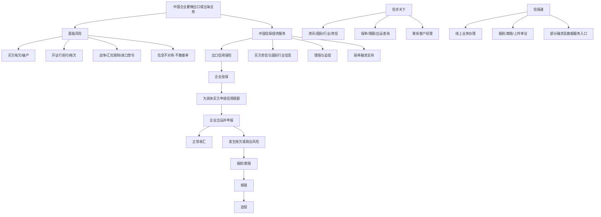
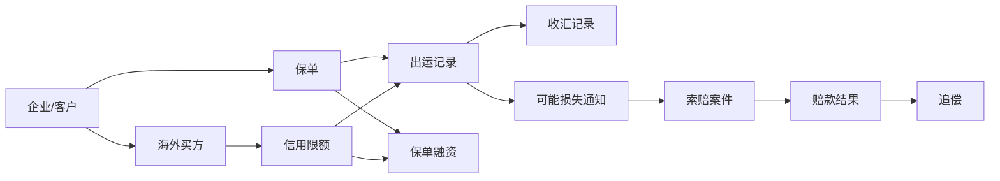

# 全局业务地图

## 一句话先懂

中国信保做的事情，可以粗暴理解成：用政策性出口信用保险和一整套风险管理能力，帮助中国企业更敢接单、更稳收款、更容易融资。

## 先看总框架

## 业务主线怎么理解

### 第一步：企业先有交易

企业先去找海外买家、谈条件、签合同。只要做的是跨境贸易，就天然会遇到两个问题：

1. 对方靠不靠谱。
2. 钱最后能不能收回来。

### 第二步：企业把风险转给中国信保一部分

企业向中国信保投保后，不代表所有风险自动都被保了。通常还要继续看：

- 这类交易是不是在保单范围内
- 这个买方有没有批到信用限额
- 企业有没有按要求申报出运
- 出险后有没有按时报损和索赔

所以你以后看到很多页面和字段，都是围绕这几个条件在控制责任边界。

### 第三步：围绕“买方”做限额管理

出口信用保险里一个很核心的动作，就是给具体买方申请信用限额。

你可以先把它理解成：

“中国信保先判断这个海外买家值不值得放账、最多能放多少账。”

所以业务系统里，“买方”和“限额”几乎一定是核心对象。

### 第四步：发货后，系统开始关心出运和收汇

货发出去了，风险才真正开始暴露。

此时系统最关心几件事：

- 什么时候出的运
- 金额是多少
- 对应哪个买方
- 对应哪个保单/限额
- 约定什么时候付款
- 实际有没有收汇

### 第五步：收不回来时，进入案件流程

如果买方拖欠、破产、拒收，或者发生战争、汇兑限制等政治风险，企业就可能进入：

`报损 -> 索赔 -> 核赔 -> 赔付 -> 追偿`

这条链路会决定系统里为什么会有案件号、单证上传、审核节点、赔款结果、追偿进度等功能。

## 用“对象”来重新看全局

这个图很重要。你以后看页面时，基本都可以问自己：这个页面是在管这里面的哪一个对象。

## 用“系统分工”来重新看全局

### 信步天下

公开资料能够确认，它至少承担这些能力：

- 实时获取信用保险资讯
- 了解国别和行业动态
- 掌握买方资信和风险信息
- 查询保单、限额、出运
- 联系客户经理
- 获取保险、融资等服务触达

所以你可以先把它理解成：

`移动端信息入口 + 风险感知工具 + 轻量客户服务入口`

### 信保通

公开资料能够确认，它至少承担这些能力：

- 作为线上客户服务窗口/统一信息服务平台
- 支持网上报损、索赔
- 支持单证资料无纸化传递
- 简化业务和财务流程
- 承担部分数据服务和线上办理功能

所以你可以先把它理解成：

`正式线上业务办理平台`

## 你作为前端最该先抓住的 3 条线

### 1. 业务对象线

保单、买方、限额、出运、案件，这些是页面的“主语”。

### 2. 流程状态线

申请、审批、生效、失效、报损、索赔、核赔、赔付、追偿，这些是页面的“动词”。

### 3. 角色权限线

客户、客户经理、承保、理赔、银行、管理员，这些决定谁能看、谁能改、谁能提交。

## 当前地图里哪些是事实，哪些是推断

### 可确认事实

- 中国信保是政策性出口信用保险机构。
- 主要产品服务包括中长期出口信用保险、海外投资保险、短期出口信用保险、国内信用保险、担保、资信服务等。
- 信步天下可提供资讯、国别行业动态、买方资信风险信息、保单/限额/出运查询及客户经理联系。
- 信保通承接线上报损索赔、单证无纸化传递等功能。

### 高概率推断

- 信步天下偏移动端轻服务，信保通偏正式办理，这是基于官方功能描述做出的高概率推断。
- 内部页面和菜单的具体结构、字段分布、权限粒度，仍需结合内部系统进一步确认。

## 资料来源

- 中国信保公司简介：https://xm.sinosure.com.cn/gywm/gsjj/gsjj.shtml
- 信步天下官方介绍：https://xm.sinosure.com.cn/mobile/ywjs/xbtxapp/index.shtml
- 中国信保 2025 数字金融服务节新闻：https://xm.sinosure.com.cn/xwzx/xbdt/219723.shtml
- 新华网转载：中国信保理赔服务成为企业“定心丸”：https://sx.sinosure.com.cn/mobile/tpxw/169910.shtml
- 短期出口信用保险产品说明书：https://sx.sinosure.com.cn/images/gywm/gsjj/xxpl/bxcpjbxx/2026/03/30/1488210575227027456.pdf
