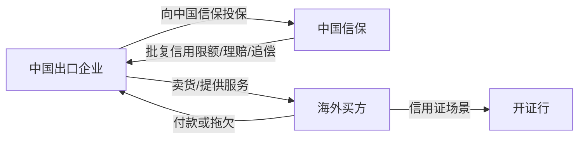

# 谁是客户、谁是买方、谁是银行、谁是被保险人

## 一句话先懂

你在这类系统里最容易绕晕的，不是流程，而是“人和机构谁是谁”。先把角色认清，很多页面就通了。

## 最核心的 4 个角色

### 1. 客户

在中国信保语境里，通常先指来办理业务、购买服务、接受风险保障的企业。

很多时候，这个“客户”就是中国出口企业本身。

### 2. 被保险人

最简单的理解：和中国信保签了保单、享受保险保障的一方。

在很多场景里：

`客户 ≈ 被保险人 ≈ 中国出口企业`

但在复杂场景里，这几个概念不一定完全重合，所以系统里经常会单独建字段。

### 3. 买方

通常指海外采购方，也就是向中国出口企业买货或买服务的一方。

买方是出口信用保险里特别重要的对象，因为很多风险最终都落在：

- 买方是否靠谱
- 买方是否按时付款
- 买方是否破产或拖欠

### 4. 银行 / 开证行

如果交易走信用证，银行就不是路人。

这里尤其要区分：

- 企业自己的合作银行
- 海外买方侧的开证行

在信用证场景下，系统可能会围绕“开证行是否履约”设计字段和风控判断。

## 你可以先这样代入

## 为什么系统里会把这些角色分这么细

因为每个角色对应的业务含义不一样：

- `客户/被保险人`：谁来申请、谁来提交、谁来索赔
- `买方`：风险到底落在哪个交易对手身上
- `银行/开证行`：某些付款义务到底由谁承担

前端一旦把角色混掉，就会看不懂：

- 这个表单为什么要选买方
- 这个列表为什么又要选客户
- 为什么案件里同时会出现买方和开证行

## 在系统里通常会出现在哪

### 客户 / 被保险人

常见在：

- 投保信息
- 保单信息
- 索赔主体
- 联系人信息

### 买方

常见在：

- 买方管理
- 信用限额申请
- 出运记录
- 可损/索赔案件
- 风险预警

### 银行 / 开证行

常见在：

- 支付方式为信用证的交易
- 理赔责任判断
- 融资相关页面

## 一个最小例子

中国公司 A 向德国公司 B 出口货物，付款方式是信用证，由德国银行 C 开证。

这时：

- `客户/被保险人`：大概率是中国公司 A
- `买方`：德国公司 B
- `开证行`：德国银行 C

如果未来系统里出现：

- 保单信息页面
- 买方限额申请
- 开证行拖欠案件

你就能知道它们分别在围绕谁运转。

## 常见误解

### 误解 1：客户就是买方

通常不是。在中国信保系统里，客户大多是中国出口企业；买方往往是海外交易对手。

### 误解 2：买方和开证行是一回事

不是。一个是交易对手，一个是金融机构。

### 误解 3：被保险人只是法务概念

不是。它往往直接影响谁能操作、谁能提交、谁能拿赔款。

## 你作为前端最该关注什么

以后只要页面上同时出现两个以上主体字段，你都先问：

1. 这是业务主体，还是交易对手？
2. 这是付款责任主体，还是申请操作主体？
3. 这个字段影响的是风控、权限，还是赔付责任？

这样你就不会把角色字段做成一锅粥。

## 资料来源

- 公司简介：https://xm.sinosure.com.cn/gywm/gsjj/gsjj.shtml
- 短期出口信用保险产品说明书：https://sx.sinosure.com.cn/images/gywm/gsjj/xxpl/bxcpjbxx/2026/03/30/1488210575227027456.pdf
- 信步天下官方介绍：https://xm.sinosure.com.cn/mobile/ywjs/xbtxapp/index.shtml
