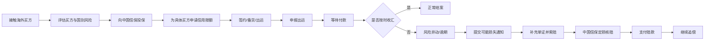

# 从接单到收汇的全链路

## 一句话先懂

你可以把出口信用保险主线先背成：

`接单 -> 投保 -> 申请限额 -> 发货/出运 -> 等待收汇 -> 出险时报损 -> 索赔 -> 理赔 -> 追偿`

## 全链路先看图

## 业务上它是什么

这条链不是“保险公司内部流程”，而是外贸交易和保险保障叠在一起形成的一条复合流程。

你以后听需求时，很多页面其实只是在这条主线里选了一个切片：

- 有的页面在管交易前风险
- 有的页面在管承保责任
- 有的页面在管出险后的案件

## 每一步到底在干什么

### 1. 接单和看买方

企业先接触海外客户，评估要不要做这笔生意。

这时最关心：

- 买方靠不靠谱
- 国别风险高不高
- 付款方式安不安全

### 2. 投保

企业和中国信保建立保障关系，拿到保单。

先注意一点：

`有保单` 不等于 `任何交易都自动赔`。

还要继续看具体买方、限额、出运申报、报损时点等条件。

### 3. 申请信用限额

这是出口信用保险里非常核心的一步。

你可以把它理解成：

“中国信保先同意你对这个买方最多赊多少钱。”

### 4. 出运与申报

企业发货或完成服务后，系统需要把这笔交易挂到保单责任上。

这一步会关联：

- 保单
- 买方
- 限额
- 金额
- 出运日期
- 付款期限

### 5. 收汇

如果买方按时付款，这条线就走向正常结束。

### 6. 风险异动和可能损失通知

一旦出现拖欠、拒收、破产、汇兑限制等异常，企业要及时通知中国信保。

很多文档和页面里会把这一步叫做：

- 报损
- 可损通知
- 可能损失通知

### 7. 索赔与理赔

企业不是一出险就自动拿赔款，还要进入索赔和核赔流程。

系统会核查：

- 是否属于保险责任
- 报损和索赔是否及时
- 单证是否齐全
- 赔付基数和赔偿比例如何计算

### 8. 追偿

赔完并不代表案件结束。中国信保还会继续追欠款。

所以案件系统里常会有：

- 已赔付
- 追偿中
- 已追回部分款项

这些后续状态。

## 你作为前端最该关注什么

### 1. 这条线的核心对象不会变

保单、买方、限额、出运、案件。

### 2. 这条线的核心动作不会变

申请、审批、申报、报损、索赔、核赔、赔付、追偿。

### 3. 绝大多数字段都在服务“责任判断”

你会反复看到日期、金额、买方、付款方式、账期、附件，这些都不是可有可无。

## 常见混淆词

### 报损

偏“先告诉中国信保出事了”。

### 索赔

偏“正式申请赔款”。

### 理赔

偏“中国信保审核并处理赔付”。

## 资料来源

- 短期出口信用保险产品说明书：https://sx.sinosure.com.cn/images/gywm/gsjj/xxpl/bxcpjbxx/2026/03/30/1488210575227027456.pdf
- 理赔指南目录：https://sx.sinosure.com.cn/mobile/khfw/lpzn/index.shtml
- 中国信保理赔服务报道：https://sx.sinosure.com.cn/mobile/tpxw/169910.shtml
