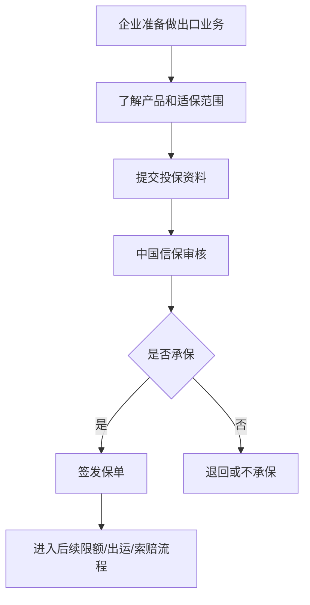

# 投保与承保

## 一句话先懂

投保就是企业来买保障，承保就是中国信保判断“这类业务我愿不愿意保、按什么条件保”。

## 先看流程图

## 业务上它是什么

### 投保

企业向中国信保申请保障，建立保险合同关系。

### 承保

中国信保基于产品规则、业务情况、风险判断，决定是否接受这类业务并形成保单。

## 这一步为什么重要

很多新人会以为“先有案件再找保险”。其实出口信用保险的逻辑更像：

先建立保障框架，再把后续交易放进这个框架里管理。

没有保单，后面很多限额、出运、索赔动作都无从谈起。

## 官方材料里能确认什么

短期出口信用保险产品说明书明确写到，保单适用于在中国境内注册企业进行的真实合法出口，交易通常要求：

- 有真实合法的贸易合同
- 信用证或非信用证支付方式
- 信用期限一般不超过 1 年

这意味着前端需求里常出现的这些字段很关键：

- 企业主体信息
- 合同信息
- 付款方式
- 账期/信用期限
- 产品类型

## 系统里通常会长成什么

### 常见页面

- 产品介绍
- 在线投保
- 投保资料填写
- 保单列表
- 保单明细

### 常见字段

- 企业名称
- 统一社会信用代码
- 联系人
- 出口类型
- 支付方式
- 保险期间
- 赔偿比例
- 最高赔偿限额

## 你作为前端最该关注什么

### 1. 投保不是简单开户

它是业务责任的起点。

### 2. 承保结果会直接影响后续流程

比如：

- 能不能申请某类限额
- 哪些交易在责任范围内
- 出险后怎么核赔

### 3. 保单类字段通常有强约束

尤其是：

- 生效/失效日期
- 保险期间
- 赔偿比例
- 最高赔偿限额

## 常见误解

### 误解 1：投保后所有交易都自动受保护

不是。后面往往还要看买方限额和出运申报。

### 误解 2：保单只是展示信息

不是。保单是后续限额、理赔、追偿判断的基础。

## 资料来源

- 公司简介：https://xm.sinosure.com.cn/gywm/gsjj/gsjj.shtml
- 短期出口信用保险产品说明书：https://sx.sinosure.com.cn/images/gywm/gsjj/xxpl/bxcpjbxx/2026/03/30/1488210575227027456.pdf
