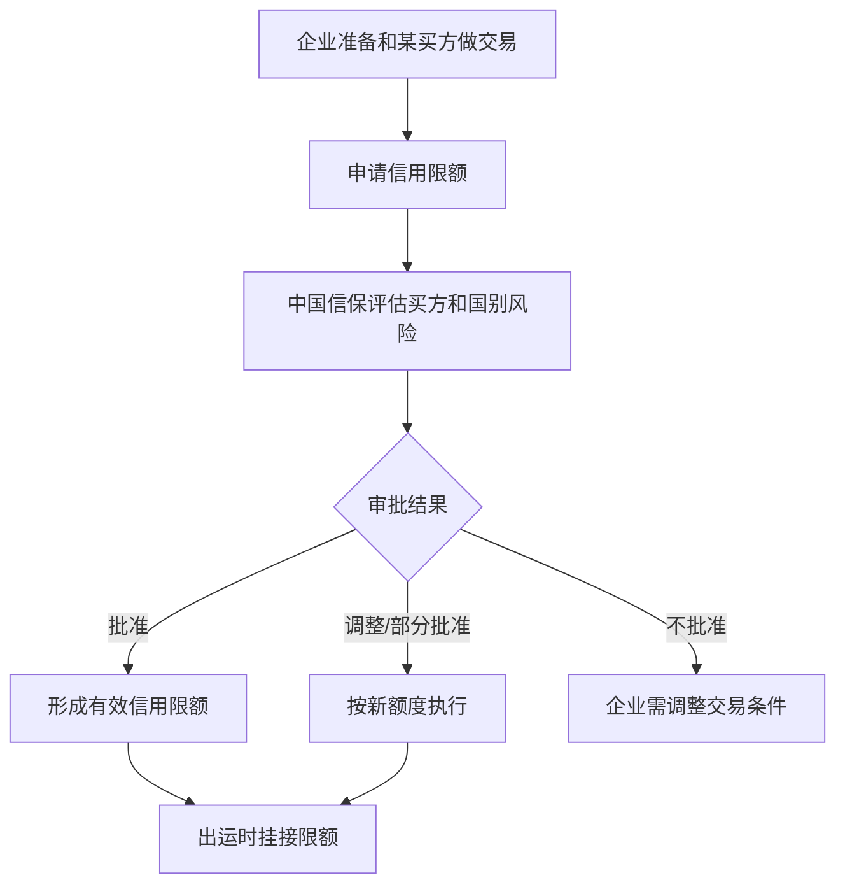

# 信用限额

## 一句话先懂

信用限额可以先理解成：中国信保愿意为某个海外买方承担风险的额度上限。

## 先看流程图

## 业务上它是什么

出口信用保险和普通保险很不一样的一点在于，它非常关注“交易对手是谁”。

同样是你这个出口企业：

- 对 A 买方也许能放很大额度
- 对 B 买方也许只能保很小额度
- 对 C 买方可能根本不建议做赊销

所以信用限额本质上是：

`按买方做风险控制`

## 官方材料里能确认什么

短期出口信用保险产品说明书明确写到：

- 信用限额是保险人批复的、对特定买方或特定开证行确定赔付基数的最高限额。
- 如果出口前没有取得有效信用限额，或者限额失效、被撤销，相应出口可能不承担赔偿责任。

这句话很关键。它解释了为什么“信用限额”在系统里一定是核心对象。

## 为什么会有这一步

因为中国信保不可能对所有买方都无限兜底。

它需要先判断：

- 买方是否可信
- 该买方所在国风险如何
- 这个额度会不会太高

## 系统里通常会长成什么

### 常见页面

- 买方列表
- 买方详情
- 信用限额申请
- 限额审批结果
- 限额调整/恢复/撤销

### 常见字段

- 买方名称
- 买方国家/地区
- 申请额度
- 已批额度
- 生效日期
- 失效日期
- 审批状态
- 风险提示

## 一个最小例子

你公司想对一个新美国买方做 100 万美元的赊销出口。

这时不是“有保单就直接发货”这么简单，而是往往要先看：

1. 中国信保是否愿意保这个买方。
2. 这个买方批了多少额度。
3. 你这次出运是否在有效额度内。

## 你作为前端最该关注什么

### 1. 限额往往是买方维度，不是企业维度

不要把“企业保单额度”和“买方信用限额”混成一类字段。

### 2. 限额会影响后续责任判断

如果没有有效限额，后续理赔责任可能直接受影响。

### 3. 限额页面大概率强依赖状态和时间

比如：

- 待审批
- 已批准
- 已失效
- 已撤销
- 调整中

这些状态非常重要。

## 高概率推断

公开资料没有完整披露内部限额页面和审批链，但根据产品说明和公开新闻，可以高概率推断：

- 限额申请/审批是系统里非常核心的一条审核流。
- 它大概率与买方资信、国别风险、出运责任校验强关联。

## 资料来源

- 短期出口信用保险产品说明书：https://sx.sinosure.com.cn/images/gywm/gsjj/xxpl/bxcpjbxx/2026/03/30/1488210575227027456.pdf
- 金融时报转载：中国信保短期出口信用保险承保金额突破 3000 亿美元：https://sx.sinosure.com.cn/mobile/tpxw/163835.shtml
- 新华网转载：中国信保理赔服务成为企业“定心丸”：https://sx.sinosure.com.cn/mobile/tpxw/169910.shtml
