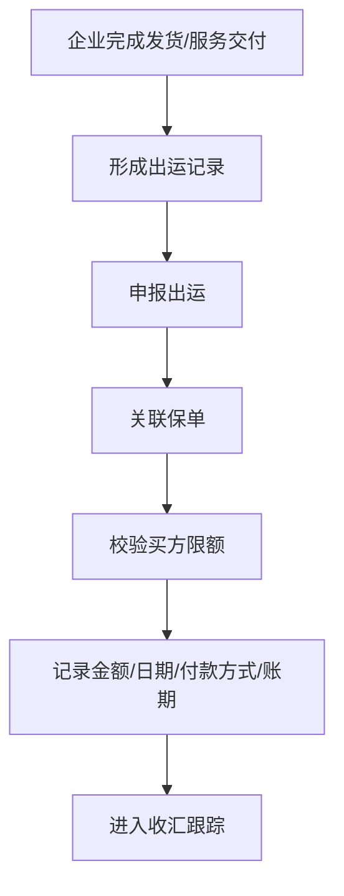

# 出运申报与保单责任关联

## 一句话先懂

出运申报可以先理解成：把“这笔已经发生的出口交易”正式挂到保单责任链上。

## 先看流程图

## 业务上它是什么

在出口信用保险里，真正有风险暴露的通常是“已经发生的交易”。

所以系统要能回答：

- 哪一笔货发出去了
- 对应哪个买方
- 对应哪张保单
- 对应哪个信用限额
- 金额和账期是多少

这就是为什么“出运申报”在系统里很重要。

## 官方材料里能确认什么

短期出口信用保险产品说明书里明确写到：

- 被保险人未申报或误申报出口，保险人有权降低赔偿比例或拒赔。
- 对于未按约定时间申报的出口，有补报要求；若补报前风险已发生，可能不承担赔偿责任。

这说明：

`出运有没有及时、准确申报` 直接关系到后续是否能赔。

## 系统里通常会长成什么

### 常见页面

- 出运申报
- 出运明细
- 批量申报
- 出运查询
- 收汇跟踪

### 常见字段

- 买方
- 保单号
- 出运日期
- 发票金额
- 币种
- 支付方式
- 信用期限
- 到期日

## 为什么前端一定要重视这一步

因为它不是简单的“业务台账”，而是保险责任证据链的一部分。

很多时候：

- 出运时间影响是否在保险期间内
- 金额影响赔付基数
- 支付方式影响责任判断
- 是否申报影响后续索赔权益

## 一个最小例子

企业已经对某买方批到 50 万美元限额，并发了一票 20 万美元货物。

如果这票货物没有按要求申报出运，后面即便买方拖欠，也可能影响赔偿责任。

## 高概率推断

公开资料没有完整展示内部出运页面，但根据产品说明和信步天下官方介绍中“查询出运”的描述，可以高概率推断：

- 出运既是业务数据对象，也是责任校验节点。
- 出运记录大概率会和保单、买方、限额、收汇进度联动。

## 资料来源

- 短期出口信用保险产品说明书：https://sx.sinosure.com.cn/images/gywm/gsjj/xxpl/bxcpjbxx/2026/03/30/1488210575227027456.pdf
- 信步天下官方介绍：https://xm.sinosure.com.cn/mobile/ywjs/xbtxapp/index.shtml
