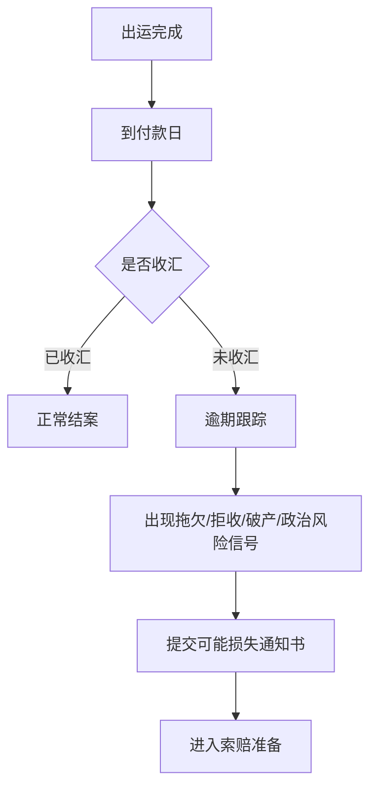

# 收汇、逾期与可损

## 一句话先懂

收汇就是看钱有没有回来；逾期就是到期还没回来；可损就是系统判断“这笔钱有较大概率收不回来了，需要尽快报给中国信保”。

## 先看流程图

## 业务上它是什么

很多人会把“出运完成”误认为交易结束，实际上出口信用保险里真正关键的往往是：

`货发出去以后，钱能不能回来`

所以系统要持续关心：

- 应收日期
- 到期日
- 实际回款日
- 回款金额
- 是否逾期
- 是否已进入风险状态

## “可损”到底是什么意思

可损是业务口语，通常对应“可能损失通知”这类动作。

你可以先理解成：

“虽然还没走完整个理赔流程，但已经出现明显风险了，必须先报案。”

## 官方材料里能确认什么

短期出口信用保险产品说明书明确写到：

- 被保险人提交《可能损失通知书》是索赔的前提条件。
- 如果未在约定期限内提交，保险人有权降低赔偿比例；超过一定期限仍未提交，可能拒赔。

这个点很重要，因为它解释了为什么系统里会单独有：

- 可损通知
- 可能损失通知书
- 报损时间

## 系统里通常会长成什么

### 常见页面

- 收汇登记
- 逾期跟踪
- 风险预警
- 可能损失通知

### 常见字段

- 应收金额
- 已收金额
- 未收金额
- 到期日
- 逾期天数
- 风险原因
- 通知提交时间

## 一个最小例子

某票货物约定 90 天付款，到了第 90 天对方还没付。

如果只是短暂技术性延迟，企业可能先催收。

但如果已经出现：

- 明确拖欠
- 买方拒收
- 买方破产
- 汇兑限制

那就不只是“催一催”，而是要尽快走可损通知。

## 你作为前端最该关注什么

### 1. 收汇不是财务附属信息

它是风险判断的核心依据。

### 2. 逾期和可损不是一回事

逾期只是时间状态；可损是风险状态。

### 3. 时间字段很敏感

比如：

- 到期日
- 逾期日
- 通知日

这些字段可能直接影响赔付权益。

## 资料来源

- 短期出口信用保险产品说明书：https://sx.sinosure.com.cn/images/gywm/gsjj/xxpl/bxcpjbxx/2026/03/30/1488210575227027456.pdf
- 中小保单客户索赔指南目录：https://sx.sinosure.com.cn/mobile/khfw/lpzn/zxbd/index.shtml
