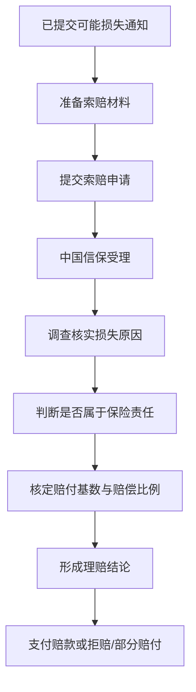

# 索赔与理赔

## 一句话先懂

索赔是企业正式申请赔款，理赔是中国信保审核后决定赔不赔、赔多少。

## 先看流程图

## 业务上它是什么

### 索赔

企业向中国信保正式提出赔款申请，并提交对应材料。

### 理赔

中国信保根据保单条款、事实调查、材料审核和责任判断，决定：

- 是否赔
- 赔多少
- 何时赔

## 官方材料里能确认什么

公开新闻和产品说明书能确认这些关键点：

- 信保通支持线上报损、索赔和单证无纸化传递。
- 提交可能损失通知是索赔前提。
- 索赔材料不全，可能影响受理。
- 赔付金额通常要结合核定损失金额、信用限额和赔偿比例等因素判断。

## 系统里通常会长成什么

### 常见页面

- 索赔申请
- 单证上传
- 索赔进度
- 核赔结果
- 赔款通知

### 常见字段

- 案件号
- 买方
- 索赔金额
- 损失原因
- 材料清单
- 受理状态
- 核赔意见
- 赔付金额

## 为什么这一块容易做复杂

因为它往往同时涉及：

- 事实调查
- 条款责任
- 风险归因
- 金额核算
- 附件留痕

所以前端上通常会出现：

- 多状态流转
- 多附件类型
- 补件逻辑
- 时间节点提醒

## 一个最小例子

买方拖欠货款，企业已经按时做了可损通知。

后续企业需要准备贸易合同、发票、出运和催收等相关材料，正式发起索赔。

中国信保受理后，会判断：

1. 这次损失是不是承保风险。
2. 企业有没有履行保单义务。
3. 应该按什么基数和比例赔。

## 你作为前端最该关注什么

### 1. “能上传材料”不等于流程就简单

附件通常直接关系到责任判断。

### 2. 案件状态一定要清晰

至少要让用户知道：

- 是否已提交
- 是否已受理
- 是否需要补件
- 是否已核赔
- 是否已赔付

### 3. 线上和线下可能同时存在

公开资料能确认线上化很强，但具体案件中仍可能有人工调查、线下核实等环节。

## 资料来源

- 中国信保理赔服务报道：https://sx.sinosure.com.cn/mobile/tpxw/169910.shtml
- 短期出口信用保险产品说明书：https://sx.sinosure.com.cn/images/gywm/gsjj/xxpl/bxcpjbxx/2026/03/30/1488210575227027456.pdf
- 中小保单客户索赔指南目录：https://sx.sinosure.com.cn/mobile/khfw/lpzn/zxbd/index.shtml
- 信保通系统线上索赔教程页面：https://sx.sinosure.com.cn/khfw/lpzn/zxbd/2026/220332.shtml
