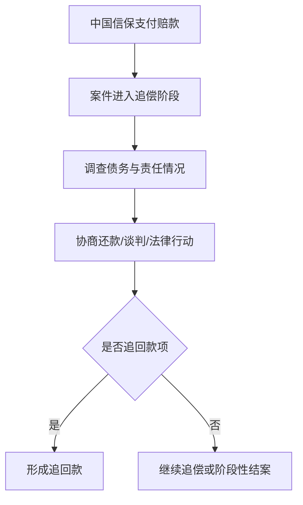

# 追偿

## 一句话先懂

追偿就是赔款支付后，中国信保继续去追那笔原本该由买方、开证行或相关责任方支付的钱。

## 先看流程图

## 业务上它是什么

理赔不是目的，尽可能把欠款追回来、减少整体损失，才是后续重要工作。

所以在出口信用保险里，赔付后还有一条长尾流程：

- 调查
- 沟通
- 谈判
- 法律追讨
- 回收款项

## 官方材料里能确认什么

公开材料能确认：

- 中国信保有覆盖全球 200 多个国家和地区的追偿渠道网络。
- 在理赔实践中，中国信保会帮助企业制定减损和追偿方案。
- 追偿不仅是“打官司”，也可能包括谈判、分期还款安排、担保设置等。

## 系统里通常会长成什么

### 常见页面

- 追偿进度
- 案件跟进记录
- 回收款记录
- 协议/法律文书管理

### 常见字段

- 追偿状态
- 已追回金额
- 未追回金额
- 还款计划
- 跟进记录
- 法律措施

## 为什么前端也要懂追偿

因为很多人会误以为赔付后页面就结束了，但真实业务里：

- 案件可能持续很久
- 会有多轮状态变化
- 可能追回部分款项

这会影响页面设计里的：

- 时间线
- 金额展示
- 案件生命周期

## 一个最小例子

中国信保已经先向企业支付了赔款，后续继续和买方谈判，买方认可债务并提出分期还款方案。

此时系统里可能会出现：

- 已赔付
- 追偿中
- 已签还款协议
- 已追回部分款项

## 常见误解

### 误解 1：赔完就结案

不一定。很多案件赔后才进入长周期追偿。

### 误解 2：追偿一定是诉讼

不一定。协商、担保、还款计划都可能属于追偿策略。

## 资料来源

- 中国信保强化理赔服务报道：https://sx.sinosure.com.cn/mobile/tpxw/192664.shtml
- 中国信保理赔服务报道：https://sx.sinosure.com.cn/mobile/tpxw/169910.shtml
- 保单融资案例中的理赔追偿描述：https://sx.sinosure.com.cn/mobile/xbsa/211916.shtml
