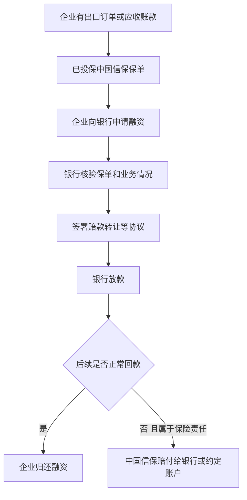

# 保单融资

## 一句话先懂

保单融资可以先理解成：企业拿着已经投保的出口交易去增信，帮助银行更愿意放款。

## 先看流程图

## 业务上它是什么

很多外贸企业不是没订单，而是没流动资金。

比如：

- 要先备货
- 要先采购原材料
- 账期又长

这时企业就有融资需求。

而中国信保的价值不只在赔付，也在于：

`让银行对这笔出口应收账款更有信心`

## 官方材料里能确认什么

公开案例能确认：

- 保单融资通常会涉及企业、中国信保、融资银行三方。
- 常见安排包括签署《赔款转让协议》。
- 如果后续发生保险责任范围内损失，中国信保可按协议向银行支付赔款。
- 银行会结合保单、商业单据、应收账款转让协议等资料办理融资。

## 系统里通常会长成什么

### 常见页面

- 融资申请入口
- 融资产品介绍
- 融资进度
- 协议管理
- 保单融资查询

### 常见字段

- 融资银行
- 融资金额
- 保单号
- 赔款转让状态
- 应收账款金额
- 放款状态

## 为什么前端要懂它

因为它解释了为什么有些需求里会同时出现：

- 保单
- 银行
- 融资
- 理赔

这些原本看起来不像一条线的对象。

## 一个最小例子

企业已经拿到订单，也投了保，但账期长达 90 天，现金流吃紧。

企业于是拿着保单和相关贸易单据去找银行融资。

如果未来买方真的拖欠，而该损失属于保险责任范围，中国信保可能按约定把赔款支付给银行，帮助降低银行坏账风险。

## 高概率推断

公开资料足以确认保单融资的基本模式，但不同产品、不同银行、不同系统里的页面和审批流可能差别很大。具体到内部系统时，仍需结合实际产品设计确认。

## 资料来源

- 保单融资案例：https://sx.sinosure.com.cn/mobile/xbsa/211916.shtml
- 金融时报关于保单融资场景介绍：https://sx.sinosure.com.cn/mobile/tpxw/215267.shtml
- 中国金融文章中对保单融资的描述：https://sx.sinosure.com.cn/mobile/tpxw/172349.shtml
