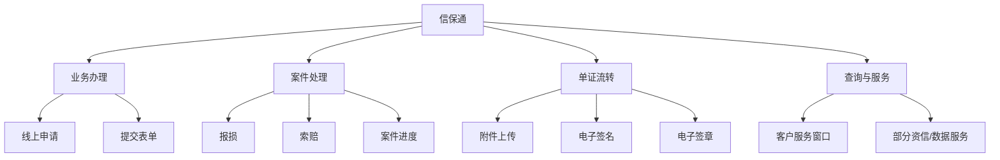

# 信保通

## 一句话先懂

你可以先把 `信保通` 理解成：中国信保面向客户的线上营业厅和统一信息服务平台，重点偏正式业务办理和线上交互。

## 官方可确认的定位

公开可查资料里，`信保通` 至少能确认这些定位：

- 是中国信保通过互联网提供金融保险服务及其他相关业务服务的品牌名称
- 是在线的客户服务窗口和统一的信息服务平台
- 支持网上报损、索赔
- 支持单证资料无纸化传递
- 支持部分资信网销数据服务
- 在历史宣传中被称为“信保通”网上服务平台或网上客服平台

另外，公开采购公告还能确认：

- `信保通` 配套数字证书、电子签章和智能密码钥匙服务仍在持续采购
- 它承载了客户业务单证的电子签名应用

## 它在业务上解决什么问题

### 1. 正式提交业务申请

例如：

- 报损
- 索赔
- 可能还有部分投保、融资或其他业务办理

### 2. 线上传递单证

这类系统的关键价值之一，是把过去大量纸质往来转成线上流转。

### 3. 作为客户侧统一入口

客户需要一个地方集中看：

- 自己提交了什么
- 当前进度到哪
- 是否需要补件

## 系统里大概率会长成什么

## 你作为前端会怎么遇到它

如果你接到的是 `信保通` 需求，它大概率更偏这些方向：

- 表单驱动
- 状态流驱动
- 附件驱动
- 审核节点驱动
- 权限和留痕要求更重

也就是说，它更像：

`业务办理系统`

而不是纯展示型产品。

## 高概率推断

结合公开资料和中国信保数字化体系介绍，可以高概率推断：

- `信保通` 更偏 PC/营业厅/重业务办理场景。
- 它和理赔、索赔、融资、资信网销、单证电子化关系更紧。
- 它的页面复杂度和状态复杂度大概率高于 `信步天下`。

这些是推断，不代表你内部看到的具体菜单和信息架构一定完全如此。

## 你最该先认识的模块名

- 网上报损
- 索赔申请
- 单证上传
- 电子签名
- 资信网销
- 提单数据查询
- 客户服务窗口

## 资料来源

- “信保通”是什么：https://sol.sinosure.com.cn/biz/solc/basicSetting/personalService/sol1.jsp
- 中国信保理赔服务报道：https://sx.sinosure.com.cn/mobile/tpxw/169910.shtml
- 资信产品收费标准（提到信保通系统/资信网销）：https://xm.sinosure.com.cn/khfw/sfbz/zgckxybxgs/2025/09/219775.shtml
- 信保通数字证书采购公告：https://eps.sinosure.com.cn/cms/channel/xmgg2/905133.htm
