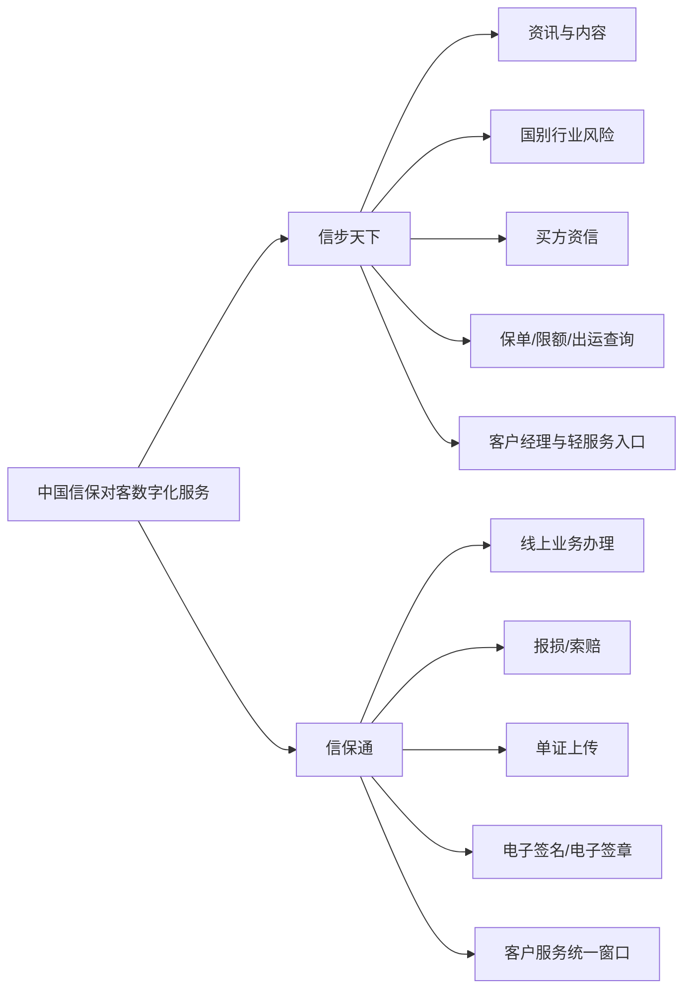

# 两个系统怎么分工

## 一句话先懂

最粗暴的记法是：

- `信步天下`：偏移动端、看信息、看风险、看业务、找服务
- `信保通`：偏正式办理、提申请、传单证、走流程

## 先看分工图

## 官方能确认到什么程度

### 可确认事实

- 中国信保已形成由 `信步天下`、`信保通`、EDI 组成的“三大主营平台”。
- `信步天下` 明确是手机 APP，强调资讯、国别行业动态、买方资信、保单/限额/出运查询、客户经理联系。
- `信保通` 明确是在线客户服务窗口和统一信息服务平台，承担网上报损索赔、单证无纸化传递等能力。

### 不能直接确认但可高概率推断的部分

- 两者的边界很可能是“轻服务触达”与“重业务办理”的区别。
- `信步天下` 大概率更强调移动化和风险感知。
- `信保通` 大概率更强调正式表单与流程闭环。

## 你为什么需要这个分工视角

因为你以后看需求时，很容易遇到这种困惑：

- 为什么同样都能看到保单信息，却要分两个系统？
- 为什么有的功能像资讯工具，有的像营业厅？
- 为什么移动端和 PC 端背后业务词汇重合度很高？

如果你先接受“分工不同，不代表业务对象不同”，这件事就容易理解了。

两个系统很多时候都围绕同一批业务对象：

- 保单
- 买方
- 限额
- 出运
- 案件

只是使用场景不同、入口不同、交互深度不同。

## 你作为前端最该关注什么

### 1. 不要按“名字”分业务，要按“动作”分业务

比如：

- 查信息、看风险、轻量触达，偏 `信步天下`
- 提交、审批、上传、留痕，偏 `信保通`

### 2. 不要误以为两个系统数据一定完全独立

高概率上它们会共享或复用部分核心业务对象，只是呈现与入口不同。

### 3. 需求讨论时优先问这三个问题

1. 这是查询型需求还是办理型需求？
2. 这是移动端场景还是营业厅场景？
3. 这次变更影响的是入口，还是底层业务对象？

## 资料来源

- 中国信保数字化服务体系新闻：https://xm.sinosure.com.cn/xwzx/xbdt/219723.shtml
- 信步天下官方介绍：https://xm.sinosure.com.cn/mobile/ywjs/xbtxapp/index.shtml
- “信保通”是什么：https://sol.sinosure.com.cn/biz/solc/basicSetting/personalService/sol1.jsp
