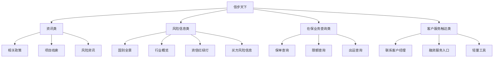

# 信步天下

## 一句话先懂

你可以先把 `信步天下` 理解成：中国信保给外贸企业用的移动端入口，重点是看信息、看风险、看在保业务，并提供轻量服务触达。

## 官方可确认的定位

中国信保官方介绍明确写到，`信步天下` 是中国信保推出的手机 APP，方便外经外贸企业：

- 实时获取最新信用保险资讯
- 了解国别、行业动态
- 掌握买方资信和风险信息
- 查询保单、限额、出运
- 联系客户经理
- 获取保险、融资等全方位服务

另外，官方宣传还提到：

- 1.0 版涵盖国别全景、行业概览、资信红绿灯、融资模拟器等十大功能板块
- 它基于中国信保大数据平台，强调“千企千面”“开箱即用”的数字化服务

## 它在业务上解决什么问题

### 1. 交易前看风险

企业想开发新客户时，最先需要的是：

- 目标国家风险如何
- 所属行业景气如何
- 这个买方是否值得接触

### 2. 交易中看在保业务

企业已经投保后，还想随时知道：

- 保单情况
- 限额情况
- 出运情况

### 3. 交易后看服务入口

遇到问题时，希望能更快联系客户经理、查看资讯、触达融资服务。

## 系统里大概率会长成什么

## 你作为前端会怎么遇到它

如果你接到的是 `信步天下` 需求，它大概率会偏这些方向：

- 首页信息流
- 风险提醒卡片
- 国别/行业详情页
- 买方信息查询页
- 保单/限额/出运查询页
- 服务入口聚合页

换句话说，它更像：

`移动端数字服务产品`

而不是“重审批、重表单、重单证”的后台系统。

## 高概率推断

根据官方公开介绍和中国信保数字化宣传，可以高概率推断：

- `信步天下` 偏前台触达、轻操作、移动端使用场景。
- 它既服务未投保前的市场开拓，也服务已投保后的业务查询。
- 它可能承接部分轻量提交动作，但其核心不是复杂审核流。

这些属于高概率推断，具体页面与菜单仍需结合内部版本确认。

## 你最该先认识的模块名

- 国别全景
- 行业概览
- 资信红绿灯
- 融资模拟器
- 风险信息发布
- 在线询保
- 保单查询
- 限额查询
- 出运查询

## 资料来源

- 信步天下官方介绍：https://xm.sinosure.com.cn/mobile/ywjs/xbtxapp/index.shtml
- 公司简介（提到信步天下等数字化产品）：https://xm.sinosure.com.cn/mobile/gsjj/index.shtml
- 江苏分公司数字功能介绍：https://js.sinosure.com.cn/jiangsu/xwzx/xbdt/214338.shtml
