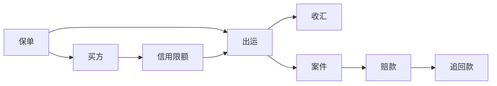

# 你最该先认识的业务对象

## 一句话先懂

别先记页面，先记对象。页面会变，对象很少变。

## 你最该先记住的 7 个对象

### 1. 保单

所有保障关系的起点。

### 2. 买方

风险评估和限额控制的核心对象。

### 3. 信用限额

决定某个买方在多大范围内能被保障。

### 4. 出运

把具体交易挂到责任链上的关键记录。

### 5. 收汇

判断钱有没有回来。

### 6. 案件

一旦出险，就会围绕案件展开报损、索赔、核赔、追偿。

### 7. 赔款 / 追回款

一个表示赔出去多少钱，一个表示后续追回来多少钱。

## 对象关系图

## 为什么这比记页面更重要

因为页面名字可能今天叫“业务总览”，明天叫“在保业务中心”；但它背后管的对象通常还是这几个。

## 你以后遇到需求时先问自己

1. 这个页面的主对象是谁？
2. 这个页面是在新增、编辑、查询，还是审批该对象？
3. 这个页面有没有和别的对象联动？

