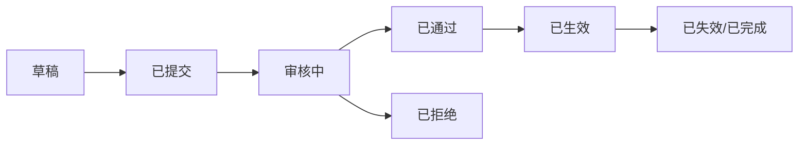

# 常见状态流转怎么理解

## 一句话先懂

状态不是为了显示颜色，而是业务流程真的走到了哪一步。

## 先看通用状态图

## 业务里常见的三类状态

### 1. 申请状态

适用于：

- 投保
- 限额申请
- 索赔申请

### 2. 业务状态

适用于：

- 保单是否生效
- 限额是否可用
- 案件是否已赔付

### 3. 交互状态

适用于：

- 是否可编辑
- 是否可补件
- 是否可撤回

## 你要特别注意

不要把“业务状态”和“UI 状态”混在一起。

例如：

- `已提交` 是业务状态
- `禁用按钮` 是 UI 表现

